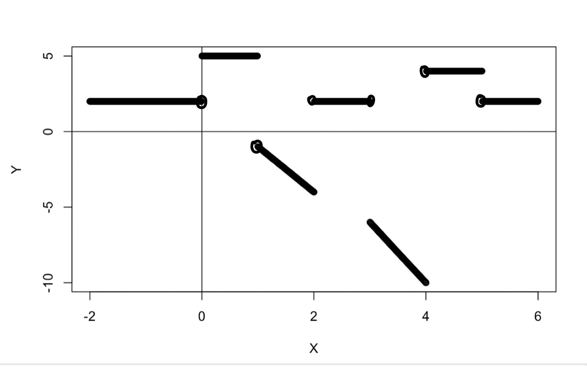

```{r setup, include=FALSE}
knitr::opts_chunk$set(echo = TRUE)
library(fastR2)
library(randomForest)
library(tree)
```

### Problem 1

```{r}

```


$$
\begin{align}
&g = argmin_g(\sum_{i=1}^{n}(y_i −g(x_i))^2 + \lambda∫[g^{(m)}(x)]^2 dx) \\\\

&a). \lambda = \infty, m = 0 \\ 
&g = argmin_g(\sum_{i=1}^{n}(y_i −g(x_i))^2 + \infty∫[g(x)]^2 dx) \\
&\text{the penalty is extremely significant when } \lambda = \infty. \text{ When m = 0, } g^0=g, \\
&\text{thus to min the RSS we have to set g(x) = 0}  \\\\
&b). \lambda = \infty, m = 1 \\
&g = argmin_g(\sum_{i=1}^{n}(y_i −g(x_i))^2 + \infty∫[g'(x)]^2 dx) \\
&\text{the penalty is extremely significant when } \lambda = \infty. \text{ When m = 1, } g^1=g', \\
&\text{thus to min the RSS we have to set g'(x) = 0 and g(x) = constant} \\\\

&c). \lambda = \infty, m = 2 \\
&g = argmin_g(\sum_{i=1}^{n}(y_i −g(x_i))^2 + \infty∫[g''(x)]^2 dx) \\
&\text{the penalty is extremely significant when } \lambda = \infty. \text{ When m = 2, } g^2=g'',\\
&\text{thus to min the RSS we have to set g''(x) = 0 and g(x) is linear function } = ax + b \\\\

&d). \lambda = \infty, m = 3 \\
&g = argmin_g(\sum_{i=1}^{n}(y_i −g(x_i))^2 + \infty∫[g'''(x)]^2 dx) \\
&\text{the penalty is extremely significant when } \lambda = \infty. \text{ When m = 3, } g^3=g''', \\
&\text{thus to min the RSS we have to set g'''(x) = 0 and g(x) is quadratic function } = ax^2 + bx +c \\\\

&e).\lambda = 0, m = 3 \\
&g = argmin_g(\sum_{i=1}^{n}(y_i −g(x_i))^2 + 0*∫[g''(x)]^2 dx) \\
&\text{the penalty is 0 when} \lambda = 0. \text{ When m = 3, } g^3=g''',\text{thus we can have g(x) interpolate all samples and have RSS = 0 } \\


\end{align}
$$


### Problem 2
$$
\begin{align}
&\hat{f} (X)=2+3I(0≤X≤2)−3(X+1)I(1≤X≤2)-2(2X −2)I(3 ≤ X ≤ 4) + 2I(4<X≤5) \\\\

&\text{When }  -2 \leq X < 0  \hat{f}(X) = 2 - 3*0 -3(X+1)*0 - 2(2X-2)*0 + 2*0 = 2 \\ 
&\text{None of the indicator variables are true; the slope is 0; the intecept is 2.} \\ \\
&\text{When 0} \leq X \leq 1: \hat{f}(X) = 2 + 3*1 -3(X+1)*0 - 2(2X-2)*0 + 2*0 = 5 \\
&\text{The indicator variables I(0≤X≤2) are true; the slope is 0; the intecept is 5.} \\\\
&\text{When } 1 < X \leq 2: \hat{f}(X) = 2 + 3*1 -3(X+1)*1 - 2(2X-2)*0 + 2*0 =-3X+2 \\
&\text{The indicator variables I(1≤X≤2) are true; the slope is -3; the intecept is 2.} \\\\
&\text{When } 2 < X < 3: \hat{f}(X) = 2 - 3*0 -3(X+1)*0 - 2(2X-2)*0 + 2*0 = 2 \\ 
&\text{None of the indicator variables are true; the slope is 0; the intecept is 2.} \\\\
&\text{When } 3 \leq X \leq 4: \hat{f}(X) = 2 - 3*0 -3(X+1)*0 - 2(2X-2)*1 + 2*0 = -4X + 6 \\  
&\text{The indicator variables I(3 ≤ X ≤ 4) are true; the slope is -4; the intecept is 6.} \\\\
&\text{When } 4 < X \leq 5: \hat{f}(X) = 2 - 3*0 -3(X+1)*0 - 2(2X-2)*0 + 2*1 = 4 \\ 
&\text{The indicator variables I(4<X≤5) are true; the slope is 0; the intecept is 4.} \\\\
&\text{When } 5 < X \leq 6: \hat{f}(X) = 2 - 3*0 -3(X+1)*0 - 2(2X-2)*0 + 2*0 = 2  \\ 
&\text{None of the indicator variables are true; the slope is 0; the intecept is 2.}
&\end{align}
$$

```{r}

```

#### Problem 3

$$
\begin{align}
&f(X) = \beta_0 + \beta_1X + \beta_2X^2 + \beta_3X^3 + \beta_4(X − \psi)_+^3 \\\\
&a). \\
&\text{If for all } X > \psi, f(X) = \beta_0 + \beta_1X + \beta_2X^2 + \beta_3X^3 + \beta_4(X − \psi)_+^3\\ 
&(X − \psi)_+^3 = (X − \psi)^3, X > \psi \\
&f(X) = f_1(X) =  (\beta_0 − \beta_4\psi^3) + (\beta_1 + 3\psi^2\beta_4)X + (\beta_2 − 3\beta_4\psi)X^2 + (\beta_3 + \beta_4)X^3 \\
&f(X) \text{ is a cubic polynomial} \\\\

&b).  \\
&\text{If for all } X \leq \psi \\
&(X − \psi)_+^3 = 0, \\
& f(X) = f_2(X) = \beta_0 + \beta_1X + \beta_2X^2 + \beta_3X^3 + \beta_4 * 0 \\
& f_2(X) = \beta_0 + \beta_1X + \beta_2X^2 + \beta_3X^3 \\
&f(X) \text{ is a cubic polynomial} \\\\

&c). \\
&\text{To show f(X) is continuous at } X=\psi \\
&f_1(X) =  (\beta_0 − \beta_4\psi^3) + (\beta_1 + 3\psi^2\beta_4)X + (\beta_2 − 3\beta_4\psi)X^2 + (\beta_3 + \beta_4)X^3 \\
&f_1(\psi) =  (\beta_0 − \beta_4\psi^3) + (\beta_1 + 3\psi^2\beta_4)\psi + (\beta_2 − 3\beta_4\psi)\psi^2 + (\beta_3 + \beta_4)\psi^3 \\
&f_1(\psi) =  \beta_0 − \beta_4\psi^3 + \beta_1\psi + 3\psi^3\beta_4 + \beta_2\psi^2 − 3\beta_4\psi^3 + \beta_3\psi^3  + \beta_4\psi^3 \\
&f_1(\psi) =  \beta_0  + \beta_1\psi  + \beta_2\psi^2  + \beta_3\psi^3  = f_2(\psi) \\
&\text{f(X) is continuous at } X=\psi \\\\

&d). \\
&\text{To show }f'(X) \text{ is continuous at } X=\psi \\
&f_1'(\psi) = \beta_1  + 2\beta_2\psi  + 3\beta_3\psi^2  = f_2'(\psi) \\
&f'(X)\text{ is continuous at } X=\psi \\\\

&e). \\
&\text{To show }f''(X) \text{ is continuous at } X=\psi \\
&f_1''(\psi) = 2\beta_2  + 6\beta_3\psi  = f_2'(\psi) \\
&f''(X)\text{ is continuous at } X=\psi \\\\

&\text{Thus f(X) is a cubic spine regardless of the value of the } \beta
\end{align} 
$$


#### Problem 4.
```{r, warnings = FALSE}
library(ISLR2)
attach(Wage)
head(Wage)
set.seed(2)
train <- sample(1:nrow(Wage), nrow(Wage) / 2)
Wage.train <- Wage[train,]
Wage.test <- Wage[-train, ]
```

```{r}
# a).polynomial
library(boot)
set.seed(1)
mse_poly <- rep(0, 10)
for (i in c(1:10)){
  glm.fit <- glm(wage ~ poly(age, i), data = Wage)
  mse_poly[i] <- cv.glm(Wage, glm.fit, K = 10)$delta[1]
}

bestdeg<- which.min(mse_poly) 
print(paste("Best degree using 10-fold CV is:", bestdeg))
plot(x = c(1:10), y = mse_poly, type = "l",
     xlab = "Degree of Poly",
     ylab = "10-fold CV MSE", main = "10-fold CV MSE for polynomial model with different degrees")
points(x = c(1:10), y = mse_poly)
```

```{r}
library(repr)
fit <- lm(wage ~ poly(age, 9), data=Wage, subset = train)
round(coef(summary(fit)), 3)

# polynomial plot with test data
agelims <- range(age)
age.grid <- seq(from = agelims[1], to = agelims[2])
preds_poly <- predict(fit, newdata=list(age=age.grid), se=TRUE)
se.bands <- cbind(preds_poly$fit + 2 * preds_poly$se.fit, 
                  preds_poly$fit - 2 * preds_poly$se.fit)

options(repr.plot.width=12, repr.plot.height=6)

plot(age, wage, xlim=agelims, cex=.5, col="darkgrey", xlab = "age", ylab = "wage")
title("Degree-9 Polynomial")
lines(age.grid, preds_poly$fit, lwd=2, col="blue")
matlines(age.grid, se.bands, lwd=1, col="blue", lty=3)

print(paste0("the mse is " , mean((predict(fit, data.frame(age = Wage.test$age)) - Wage.test$wage)^2)))
```
  The MSE of degree 9 polynomial is 1598. I used 10-fold cv to find the degree of polynomials with smallest MSE. The degree is 9. The plot is based on all data. The confidence band is quite obvious on all domain of age especially on the two ends.

```{r}
# b). stepwise function
fit <- lm(wage ~ cut(age, 7), data=Wage, subset = train)
round(coef(summary(fit)), 3)
agelims <- range(age)
age.grid <- seq(from = agelims[1], to = agelims[2])
preds_cut <- predict(fit, newdata=list(age=age.grid), se=TRUE)
se.bands <- cbind(preds_cut$fit + 2 * preds_cut$se.fit, 
                  preds_cut$fit - 2 * preds_cut$se.fit)

options(repr.plot.width=12, repr.plot.height=6)

plot(age, wage, xlim=agelims, cex=.5, col="darkgrey", xlab = "age", ylab = "wage")
title("7-cut stepwise function")
lines(age.grid, preds_cut$fit, lwd=2, col="blue")
matlines(age.grid, se.bands, lwd=1, col="blue", lty=3)

print(paste0("the mse is " , mean((predict(fit, data.frame(age = Wage.test$age)) - Wage.test$wage)^2)))
```
The MSE for stepwise function is 1620.4153. I use 7 cut in this case. We can see the confidence band is getting large when the domain of age is greater than 60. Comparing the polynomials, it has better confidence band when the age is small.

```{r}
# c). piece-wise function
grid1 <- seq(from = agelims[1], to = 33.5)
grid2 <- seq(from = 33.5, to = 49)
grid3 <- seq(from = 49, to = 64.5)
grid4 <- seq(from = 64.5, to = agelims[2])

pred1 <- predict(lm(wage ~ poly(age, 3), data = Wage.train[Wage.train$age < 33.5,]), newdata = list(age = grid1), se = TRUE)
bands1 <- cbind(pred1$fit + 2* pred1$se.fit, 
                  pred1$fit - 2 * pred1$se.fit)
pred2 <- predict(lm(wage ~ poly(age, 3), data = Wage.train[Wage.train$age > 33.5 & Wage.train$age <= 49,]), newdata = list(age = grid2), se = TRUE)
bands2 <- cbind(pred2$fit + 2* pred2$se.fit, 
                  pred2$fit - 2 * pred2$se.fit)
pred3 <- predict(lm(wage ~ poly(age, 3), data = Wage.train[Wage.train$age > 49 & Wage.train$age <= 64.5,]), newdata = list(age = grid3), se = TRUE)
bands3 <- cbind(pred3$fit + 2* pred3$se.fit, 
                  pred3$fit - 2 * pred3$se.fit)
pred4 <- predict(lm(wage ~ poly(age, 3), data = Wage.train[Wage.train$age > 64.5,]), newdata = list(age = grid4), se = TRUE)
bands4 <- cbind(pred4$fit + 2* pred4$se.fit, 
                  pred4$fit - 2 * pred4$se.fit)

plot(age, wage, xlim = agelims, cex = .5, col = "darkgrey", xlab = "age", ylab = "wage", main = "piecewise function")
matlines(grid1, bands1, lwd=1, col="blue", ity = "dashed")
matlines(grid2, bands2, lwd=1, col="blue", ity = "dashed")
matlines(grid3, bands3, lwd=1, col="blue", ity = "dashed")
matlines(grid4, bands4, lwd=1, col="blue", ity = "dashed")
lines(grid1, pred1$fit, lwd=2, col="blue")
lines(grid2, pred2$fit, lwd=2, col="blue")
lines(grid3, pred3$fit, lwd=2, col="blue")
lines(grid4, pred4$fit, lwd=2, col="blue")
```

  I fit the piecewise function with three knots: 33.5, 49, 64.5 for four intervals with degree of 3. The function is not continuous. The confidence bond is getting wider at the fourth interval which is for age greater than 64.5.
  
```{r}
# d). cubic spline
library(splines)
fit <- lm(wage ~ bs(age, knots = c(25, 40, 60)), data = Wage, subset = train)
pred_bs <- predict(fit, newdata = list(age = age.grid), se = T)

summary(fit)
print(paste0("the mse is " , mean((predict(fit, data.frame(age = Wage.test$age)) - Wage.test$wage)^2)))
```

```{r}
par(mfrow=c(1, 2))
plot(age, wage, col="gray", main="Cubic regression spline", cex=.5, xlab = "age", ylab = "wage")
lines(age.grid, pred_bs$fit, lwd=2)
lines(age.grid, pred_bs$fit + 2 * pred_bs$se, lty="dashed")
lines(age.grid, pred_bs$fit - 2 * pred_bs$se, lty="dashed")
abline(v=25, lty="dashed", col="blue")
abline(v=40, lty="dashed", col="blue")
abline(v=60, lty="dashed", col="blue")
```

  For cubic spline, I used the knots (25, 40, 60). The confidence bonds on two ends are getting wider as well. The MSE is 1600.3543
  
```{r}
# e). smoothing spline
fit <- smooth.spline(Wage.train$age, Wage.train$wage, cv = TRUE)
fit2 <- smooth.spline(Wage.train$age, Wage.train$wage, df = 5)
summary(fit)
plot(age, wage, xlim = agelims, cex=.5, col="darkgrey", main="Smoothing Spline", xlab = "age", ylab = "wage")
lines(fit, col = "blue", lwd = 2)
lines(fit2, col = "red", lwd = 2)
```
  
  I choose df = 5 and fit into the training data. We could see the red line represents the df = 5 and the blue line is the default. The two lines match with each other very well, which is much better than the previous models. I think this one yielding the best result on the test set. 


#### Problem 5.

```{r}
#Auto
df <- subset(Auto, select = -name)
head(df)
```

##### a).
```{r}
set.seed(1)
train <- sample(1: nrow(df), nrow(df) / 2)
auto.test <- df[-train, "mpg"]

tree.auto <- tree(mpg ~ ., df, subset = train, control = tree.control(nobs = length(train), mindev = 0))
summary(tree.auto)
```

```{r}
#big tree
plot(tree.auto)
text(tree.auto, pretty = 0)
```


```{r}
#pruned tree
prune.auto <- prune.tree(tree.auto, best = 7) # pruned tree
plot(prune.auto)
text(prune.auto , pretty = 0)
```
```{r}
tree.pred <- predict(tree.auto, newdata = df[-train,]) 
plot(tree.pred, auto.test, xlab = "prediction", ylab = "value in test set")
abline(0,1)
mean((tree.pred - auto.test)^2) #the test MSE for unpruned tree
```

```{r}
for (i in 2:10) {
  prune.auto <- prune.tree(tree.auto, best = i)
  prune.pred <- predict(prune.auto, newdata = df[-train,]) 
  MSE <- round(mean((prune.pred - auto.test)^2), 4)
  print(paste0("The MSE is ", MSE, " when best is ", i)) #the test MSE for pruned tree
}
```

  The MSE for unpruned tree is 9.366727. The MSE for pruned tree with size from 2-10 are 26.0513,             20.0664, 18.7148, 16.6175, 13.306, 12.8271, 12.6116, 11.578, 11.6808 respectively, which are all higher than the unpruned tree. The best size is 9 in this case.


##### b).
```{r}
set.seed(1)
bag.auto <- randomForest(mpg ~ ., data = df, subset = train, mtry = 7, importance = TRUE)
bag.auto
```

```{r}
bag.pred <- predict(bag.auto, newdata = df[-train,]) 
plot(bag.pred, auto.test, xlab = "bagging prediction", ylab = "value in test set")
abline(0, 1)
mean((bag.pred - auto.test)^2) 
```
  
  The MSE for bagging is 7.023526. The tuning parameters is m=p=7 for regression tree.
  
##### c).
```{r}
set.seed(1)
rf.auto <- randomForest(mpg ~ ., data = df, 
                         subset = train, mtry = 7/3, importance = T)
yhat.rf <- predict(rf.auto, newdata = df[-train, ])
mean((yhat.rf - auto.test)^2)
varImpPlot(rf.auto)

plot(yhat.rf, auto.test, xlab = "rf prediction", ylab = "value in test set")
abline(0, 1)
```
  
  The MSE is 6.9586. The tuning parameter is m=p/3 = 7/3 since it's for regression.

##### d).
```{r}
library(gam)
gam.m <- gam(mpg ~ s(cylinders) + s(displacement) + s(horsepower) + s(weight) + s(acceleration) + s(year) + origin, data = df, subset = train)
summary(gam.m)
par(mfrow=c(1, 3))
plot(gam.m, se=TRUE, col="blue")
yhat.gam <- predict(gam.m, newdata = df[-train, ])
mean((yhat.gam - auto.test)^2)
```
  
  The MSE is 6.47. The "Anova for Parametric effects" p-values clearly demonstrate that all  predictors are highly statistically significant, even when assuming a linear relationship. The "Anova for Nonparametrically effects" p-values for displacement and horsepower. The large p-value for these two predictors shows that a linear function is adequate for these variable.


##### e).
  I prefer regression tree model. For accuracy, its MSE is 9.3667 which is not too away from gam tree which is 6.47. I believe regression tree is the easiest one to interpret for all groups of people since it just simply split the data into two groups repeatedly to find the best classification. 

