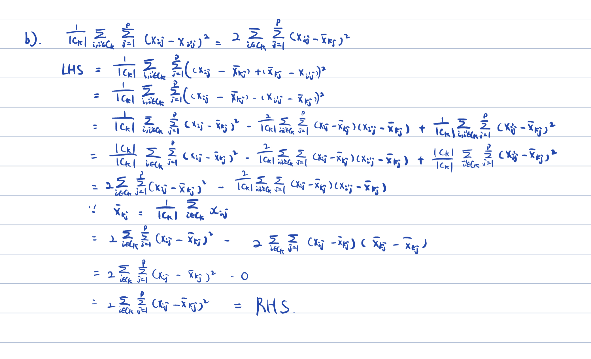

```{r setup, include=FALSE}
knitr::opts_chunk$set(echo = TRUE)
library(tidyverse)
```


### Problem 1

#### a).
$$
y_i = \beta_0 + \beta_1z_{i1} + \beta_2z_{i2} + ... +  \beta_Mz_{iM} + \epsilon_i
$$ 

#### b).
$$
z_{im} = \phi_{1m}x_{i1} + \phi_{2m}x_{i2} + ... + \phi_{pm}x_{ip}  \\ 
\text{Plug this equation to part a:} \\
y_i = \beta_0 + \beta_1(\phi_{11}x_{i1} + \phi_{21}x_{i2} + ... + \phi_{p1}x_{ip})\\
+ \beta_2(\phi_{12}x_{i1} + \phi_{22}x_{i2} + ... + \phi_{p2}x_{ip}) \\
+ ... +  \beta_M(\phi_{1M}x_{i1} + \phi_{2M}x_{i2} + ... + \phi_{pM}x_{ip}) + \epsilon_i
$$

#### c).
$$
y_i =  \beta_0 + \beta_1\phi_{11}x_{i1} + \beta_1\phi_{21}x_{i2} + ... + \beta_1\phi_{p1}x_{ip}\\
+ \beta_2\phi_{12}x_{i1} + \beta_2\phi_{22}x_{i2} + ... + \beta_2\phi_{p2}x_{ip} \\
+ ... +  \beta_M\phi_{1M}x_{i1} + \beta_M\phi_{2M}x_{i2} + ... + \beta_M\phi_{pM}x_{ip} + \epsilon_i \\
= \beta_0 + (\beta_1\phi_{11}+\beta_2\phi_{12}+...+\beta_M\phi_{1M})x_{i1} + (\beta_1\phi_{21} + \beta_2\phi_{22} + ... + \beta_M\phi_{2M})x_{i2} \\
+...+ (\beta_1\phi_{p1} + \beta_2\phi_{p2} +...+ \beta_M\phi_{pM})x_{ip} +  \epsilon_i \\ 
\beta_1\phi_{a1}+\beta_2\phi_{a2}+...+\beta_M\phi_{aM} \text{ is a constant for a > 0}
\\
\text{ We can see the principal components regression model is linear in the columns of X.}
$$


#### d).
It's False. Since we only use the first M PC instead of the whole columns of X, if we choose the different PC, which may give us different prediction than using the columns of X. It turns out that constraining each Z to be uncorrelated with other Z is equivalent to constraining the direction to be orthogonal and giving us less variance. 


### Problem 2

#### a).
```{r}
matrix = array(rnorm(320), dim=c(20,16))

matrix[1:10, 16] <- 1
matrix[11:20, 16] <- 2
```


```{r}
# cluster 1
# left hand side:
sum = 0
for (i in 1:10) {
  for (i2 in 1:10) {
    for (j in 1:15) {
      sum = sum + (matrix[i, j] - matrix[i2, j])^2
    }
  }
}
c1_left <- sum/10

# right hand side:
sum2 <- 0
for (i in 1:10) {
  for (j in 1:15) {
      sum2 = sum2 + (matrix[i, j] - mean(matrix[1:10, j]))^2
  }
}
c1_right <- sum2 * 2

c1_right 
c1_left
c1_right - c1_left 
```

```{r}
# cluster 2
# left hand side:
sum = 0
for (i in 11:20) {
  for (i2 in 11:20) {
    for (j in 1:15) {
      sum = sum + (matrix[i, j] - matrix[i2, j])^2
    }
  }
}
c1_left <- sum/10

# right hand side:
sum2 <- 0
for (i in 11:20) {
  for (j in 1:15) {
      sum2 = sum2 + (matrix[i, j] - mean(matrix[11:20, j]))^2
  }
}
c1_right <- sum2 * 2

c1_right 
c1_left
c1_right - c1_left 
```

  The left side is equal to the right side for both clusters. 

#### b).
```{r}

```


### Problem 3

#### a).
```{r}
set.seed(1)
df <- data.frame(replicate(50, rnorm(20, mean = 1,  sd = 1))) %>%
    rbind(data.frame(replicate(50, rnorm(20, mean = 2, sd = 1)))) %>%
    rbind(data.frame(replicate(50, rnorm(20, mean = 3, sd = 1)))) %>%
    as.tibble %>%
    mutate(id = row_number(),
           class = ifelse(id <= 20, 'a',
                          ifelse(id <= 40, 'b',
                                 'c'))) %>%
    select(-id)
``` 

#### b).
```{r}
pr.out <- prcomp(df %>% select(-class), scale = TRUE)
ggplot(data.frame(PC1 = pr.out$x[,1], PC2 = pr.out$x[,2], class = df$class),
       aes(x = PC1, y = PC2, col = class)) + geom_point()
```

#### c).
```{r}
km.out <- kmeans(df %>% select(-class), 3, nstart = 20)
table(df$class, km.out$cluster) 
```

  The k-means clusters perform perfect on the observations.
  
#### d).
```{r}
km.out2 <- kmeans(df %>% select(-class), 2, nstart = 20)
table(df$class, km.out2$cluster) 
```

  The observations a and b are included into one cluster (cluster 2)
  
#### e).
```{r}
km.out4 <- kmeans(df %>% select(-class), 4, nstart = 20)
table(df$class, km.out4$cluster) 
```

  The observation a is separated into the cluster 1 and 2.
  
#### f).
```{r}
km.outpca <- kmeans(pr.out$x[,1:2], 3, nstart = 20)
table(df$class, km.outpca$cluster) 
```

  The k-means clusters perform perfect on the observations.
  
#### g).
```{r}
km.outscale <- kmeans(scale(df %>% select(-class)), 3, nstart = 20)
table(df$class, km.outscale$cluster) 
```
  
  It performs as perfect as part c
  
### Problem 4

```{r}
library(ISLR2)
library(e1071)
#head(OJ)
dim(OJ)
```

#### a).
```{r}
set.seed(1)
is.train <- sample(dim(OJ)[1],800)
OJ.train <- OJ[is.train, ]
OJ.test <- OJ[-is.train, ]
```

#### b).
```{r}
set.seed(1)
svmfit <- svm(Purchase ~ ., data = OJ.train, kernel = "linear", cost = 0.01)
summary(svmfit)
```

The number of support vectors is 435 which is a considerable number since we only have 800 data in training set. The number of classes is 2 with level of CH and MM.

#### c).
```{r}
pred_train <- predict(svmfit, OJ.train)
table(predict = pred_train, truth = OJ.train$Purchase)
print(paste("The training error for train is ", (65+75) /800))
```

```{r}
pred_test <- predict(svmfit, OJ.test)
table(predict = pred_test, truth = OJ.test$Purchase)
print(paste("The test error is ", (15+33) / 270))
```

#### d). 
```{r}
set.seed(1)
tune.out.linear <- tune(svm, Purchase ~., data = OJ.train, kernel = "linear",
                ranges = list(cost = c(0.001, 0.01, 0.1, 1, 5, 10)))
summary(tune.out.linear)
```

  The optimal cost is 0.1/5 with error 0.17250
  
#### e).
```{r}
pred_train_e <- predict(tune.out.linear$best.model, OJ.train)
table(predict = pred_train_e, truth = OJ.train$Purchase)
print(paste("The training error for tune with cost = 0.1/5 is ", (63 + 69) /800))
```

```{r}
pred_test_e <- predict(tune.out.linear$best.model, OJ.test)
table(predict = pred_test_e, truth = OJ.test$Purchase)
print(paste("The testing error for tune with cost = 0.1/5 is ", (13 + 31) /270))
```


#### f).
```{r}
set.seed(1)
svmrad <- svm(Purchase ~ ., data = OJ.train, kernel = "radial", cost = 0.01)
summary(svmrad)
```
  The number of support vectors is 634 (319, 315). The number of classes is 2 (CH, MM)
  

```{r}
pred_train_rad <- predict(svmrad, OJ.train)
table(predict = pred_train_rad, truth = OJ.train$Purchase)
pred_test_rad <- predict(svmrad, OJ.test)
table(predict = pred_test_rad, truth = OJ.test$Purchase)
print(paste("The training error is ", 315 /800))
print(paste("The test error test is ", 102 / 270))
```
```{r}
set.seed(1)
tune.out.rad <- tune(svm, Purchase ~., data = OJ.train, kernel = "radial",
                ranges = list(cost = c(0.001, 0.01, 0.1, 1, 5, 10)))
summary(tune.out.rad)
```

  The optimal cost is 1 with error = 0.17125.

```{r}
pred_train_f <- predict(tune.out.rad$best.model, OJ.train)
table(predict = pred_train_f, truth = OJ.train$Purchase)
pred_train_ftest <- predict(tune.out.rad$best.model, OJ.test)
table(predict = pred_train_ftest, truth = OJ.test$Purchase)
print(paste("The training error for tune with cost = 1 is ", (44 + 77) /800))
print(paste("The testing error for tune with cost = 1 is ", (17 + 33) /270))
```

#### g
```{r}
set.seed(1)
svmpoly <- svm(Purchase ~ ., data = OJ.train, kernel = "polynomial", cost = 0.01, degree = 2)
summary(svmpoly)
```
  The number of support vectors is 636 (321, 315). The number of classes is 2 (CH, MM)
  
```{r}
pred_train_poly <- predict(svmpoly, OJ.train)
table(predict = pred_train_poly, truth = OJ.train$Purchase)
pred_test_poly <- predict(svmpoly, OJ.test)
table(predict = pred_test_poly, truth = OJ.test$Purchase)
print(paste("The training error for train is ", (1+297) /800))
print(paste("The test error for test is ", (1+98) / 270))
```
```{r}
set.seed(1)
tune.out.poly <- tune(svm, Purchase ~., data = OJ.train, kernel = "polynomial",
                ranges = list(cost = c(0.001, 0.01, 0.1, 1, 5, 10)))
summary(tune.out.poly)
```

  The optimal cost is 1 with error = 0.18500	

```{r}
pred_train_g <- predict(tune.out.poly$best.model, OJ.train)
table(predict = pred_train_g, truth = OJ.train$Purchase)
pred_train_gtest <- predict(tune.out.poly$best.model, OJ.test)
table(predict = pred_train_gtest, truth = OJ.test$Purchase)
print(paste("The training error for tune with cost = 1 is ", (39 + 91) /800))
print(paste("The testing error for tune with cost = 1 is ", (13 + 47) /270))
```

#### h).
  The radial model with cost = 1 on tune giving training error with 0.151 on training data is the best for training. 
  The linear model with cost = 0.1/5 on tune giving training error with 0.1629 on testing data is the best results. 

